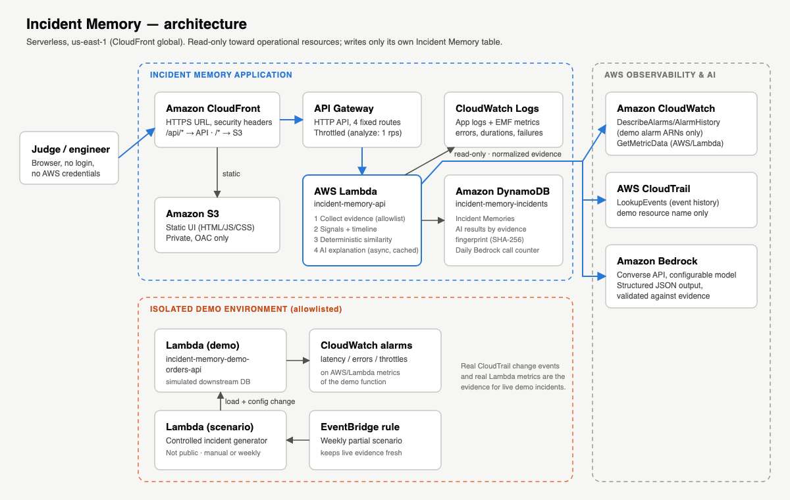

# Incident Memory

**Your infrastructure remembers what happened last time.**

Live demo: **https://d2zs12dmk7373h.cloudfront.net** (no login, no AWS credentials)

AWS Zero to Shipped Hackathon · Category: **Commercial potential** · Lane: **Startup**

> Incident Memory turns an AWS alarm into an answer: what changed, which past failure matches, and what worked last time. In the featured demo, captured CloudWatch and CloudTrail evidence matches a seeded, different-cause historical incident at 82%, surfacing the previous rollback and 14-minute recovery.

---

## The problem

Monitoring tools tell engineers that something is wrong. The engineers then spend time
reconstructing what changed, what happened previously, and whether the team has already
solved the same problem. That knowledge usually lives in someone's head, a chat
thread, or a postmortem nobody can find at 2 a.m.

### Who built it

Incident Memory is built by **Satoshi Kimura**, founder of **ENOXA**, the company behind **[Gatepath](https://gatepath.jp)**,
a permission-aware enterprise knowledge search across Slack, Google Drive, Microsoft 365, Confluence, Jira, GitHub and more.
Running Gatepath on AWS, I kept re-investigating the same alarm patterns, and that is why I built Incident Memory.
Incident Memory is a standalone product: it does not connect to Gatepath or read any Gatepath data.

## The solution

Incident Memory turns operational events into reusable organizational memory.

When a new AWS incident occurs, it:

1. collects bounded **CloudWatch** and **CloudTrail** evidence around the alarm,
2. reconstructs a **timeline** and structured **signals** (every item has an evidence ID such as `CT-001`, `CW-002`),
3. stores the incident as a structured **Incident Memory** in DynamoDB,
4. compares it with previous incidents using a **deterministic, explainable similarity score**, and
5. explains, with **Amazon Bedrock**, what is similar, what the suspected cause was last time,
   what the team did, and how long recovery took.

It does not only analyze what is happening now. It asks:
**Have we seen this pattern before, and what happened last time?**

> **82% similar to INC-0012** (ten weeks earlier). The direct cause was different: a database connection pool
> change there, a Lambda timeout/retry configuration change here. But the degradation followed the same sequence:
> configuration change → errors ↑ → latency ↑ → concurrency ↑ → latency alarm. **Last time, the errors alarm fired
> 3 minutes after the latency alarm.** The team reverted the pool change and recovered 14 minutes after the alarm.

The point is not to find an identical failure. It is to recognize a **similar operational pattern**
across different resources and causes, and to explain exactly why it matched and where it differs.

### How is this different from CloudWatch investigations?

Amazon CloudWatch investigations helps you investigate what is happening now: it correlates metrics, logs,
deployments and CloudTrail changes and suggests hypotheses. Its data is kept for 7 to 90 days, and AWS recommends
copying important incident reports elsewhere to keep them longer
([CloudWatch investigations data retention](https://docs.aws.amazon.com/AmazonCloudWatch/latest/monitoring/Investigations-Retention.html)).

Incident Memory is that "elsewhere", and more: **long-term operational memory**. Every incident is kept as a
structured memory (trigger, timeline, signals, changes, cause, resolution, pattern). When a similar pattern returns,
even with a different cause, Incident Memory shows why it matches, what is different, and **what the team did
last time and how long recovery took**.

> Monitoring helps you understand what is happening now. Incident Memory remembers what worked last time.

## What makes it different

- **Memory, not a log summarizer.** Incidents are stored as structured data (trigger, timeline,
  signals, changes, causes, resolution, normalized pattern) and can be compared later.
- **Explainable scores.** Similarity comes from five documented factors ([docs/SIMILARITY.md](docs/SIMILARITY.md)).
  The AI explains the score but never produces it.
- **Evidence-grounded AI.** Every suspected cause cites evidence IDs. Unsupported claims are
  dropped, and *Insufficient evidence* is a valid answer.
- **Read-only and isolated.** Two layers: least-privilege IAM plus an application allowlist.
  No remediation and no AWS changes from the public app.
- **No always-on compute; idle infrastructure cost is minimal.** Serverless only. Bedrock results are cached by evidence fingerprint and capped per day.

## Try the demo (60 seconds)

1. Open the live URL.
2. Under **Recent analyzed incidents**, open *Orders API latency after Lambda configuration change*
   (source `CAPTURED DEMO`: real CloudWatch and CloudTrail evidence collected from the isolated AWS demo environment).
3. Click **Analyze Incident**.
4. Read the result:
   - **The match**: "N% similar to INC-0012" (a different cause: a database connection pool change),
     **Why N% similar?** (what matches), **What is different**, and **What happened last time?**
     (previous suspected cause, action, outcome, recovery time)
   - **Timeline**: a Lambda configuration change (CloudTrail), then errors ↑, latency ↑ and concurrency ↑ (CloudWatch),
     then the latency alarm. Times are shown relative to Started (the alarm time)
   - **Suspected Causes** with confidence and evidence IDs
   - **Similar Incidents** with the per-factor score breakdown
5. Open **INC-0012** to see the historical memory it matched.

Data sources are labeled in the UI:

| Label | Meaning |
|---|---|
| **LIVE DEMO** | Collected now from CloudWatch and CloudTrail in the isolated AWS demo environment (while the incident's window is still open) |
| **CAPTURED DEMO** | Collected earlier from a controlled incident in the isolated AWS demo environment and kept as a memory. A live incident becomes captured once it has recovered and its evidence window is complete |
| **CAPTURED REAL-WORLD** | Imported from a production system's exported CloudWatch alarm history and metric datapoints, sanitized (names, account IDs, ARNs and identifiers removed). Facts only: no cause, change or action is added |
| **SEEDED DEMO** | Fictional incident created for comparison. It did not occur in AWS |

### Two kinds of proof

- **Pattern similarity across different causes (demo data):** the Lambda demo incident matches INC-0012 at 82 %
  although the cause and the changed resource differ.
- **Exact recurrence in real production data:** one production database free-memory alarm went through 27
  ALARM → OK cycles between 2026-09-21 and 2026-09-26. Each cycle is its own memory and matches the previous cycle
  (same metric, threshold and sequence); the UI also shows what differed (lowest value, recovery time). The cause is
  shown as *Insufficient evidence* and the action as *No resolution recorded*, because the data contains neither.

Incident status: **Open · alarm active** (still in ALARM), **Recovered · no resolution recorded**
(alarms returned to OK, no action recorded), **Resolved** (resolution recorded; used for historical comparison).

## Architecture



CloudFront + S3 → API Gateway (HTTP API) → Lambda (Python) → DynamoDB, with read-only
CloudWatch and CloudTrail access and Amazon Bedrock for explanations. Details:
[docs/ARCHITECTURE.md](docs/ARCHITECTURE.md).

## Repository layout

```
backend/app/        Lambda application (collectors, signals, memory, similarity, AI, API)
backend/tests/      Unit and pipeline tests (python -m unittest)
backend/scripts/    seed.py (SEEDED_DEMO history), capture.py (CAPTURED_DEMO from a real run)
demo/               Demo workload Lambda + controlled incident generator
frontend/           Static UI (no build step)
infra/              Terraform (dedicated state, us-east-1)
docs/               Architecture, similarity, deployment, submission, evidence
```

## Local development

```
cd backend
python3 -m venv ../.venv
../.venv/bin/pip install anthropic boto3
../.venv/bin/python -m unittest discover -s tests
STORE_BACKEND=memory BEDROCK_CLIENT=disabled \
  ../.venv/bin/python local_server.py --fixture
```

`--fixture` uses synthetic collectors for UI work without AWS access. Without the flag,
the server reads the real demo environment with your local AWS profile.

## Deployment

See [docs/DEPLOYMENT.md](docs/DEPLOYMENT.md).

## Scope

This is a hackathon MVP. Out of scope: remediation, customer account onboarding,
multi-tenancy, billing, chat, and integrations (Slack, Datadog, GitHub).
